# 🧠 ML & Fine-Tuning Fundamentals — From Zero to Enterprise

> A self-contained, fully executed 6-module learning series for anyone who wants to go from **knowing what AI does** to **knowing how it actually works** — and getting hired for it.

---

## 📌 Who Is This For?

| If you are… | You will get… |
|---|---|
| Coming from a GenAI/prompting background | The ML foundation you're missing for job interviews |
| Self-taught and patchy on fundamentals | A structured path from basics to production |
| Preparing for ML/AI Engineering interviews | Runnable examples + interview Q&As in every module |
| A team lead wanting to share ML knowledge | Shareable notebooks with layman explanations throughout |

**No math degree required.** Every formula is explained in plain English first.

---

## 🗺️ Series Overview

```
Module 1          Module 2          Module 3          Module 4          Module 5          Module 6
Traditional ML ──► Deep Learning ──► Transfer       ──► PEFT / LoRA  ──► RLHF &        ──► MLOps &
(scikit-learn)     (PyTorch)          Learning           (Fine-tuning     Alignment          Production
                                      (BERT)             LLMs cheaply)   (ChatGPT's         Pipeline
                                                                          secret sauce)
    ↑                  ↑                  ↑                  ↑                ↑                ↑
 Start here       Builds on M1      Bridges M2→LLMs    Bridges M3→M5   Builds on M4    Wraps all 6
```

Each module builds on the previous one. The same **telecom churn prediction** use case threads through Modules 1–2–6 so you can see the same problem solved at each level of complexity.

---

## ⚡ Quick Start

### Option A — Google Colab (Recommended, zero setup)
1. Go to [colab.research.google.com](https://colab.research.google.com)
2. `File → Open notebook → GitHub`
3. Enter: `abivarma/finetune`
4. Pick any module notebook
5. **All outputs are already embedded — you can read without running a single cell**

### Option B — Run Locally
```bash
# Clone the repo
git clone https://github.com/abivarma/finetune.git
cd finetune

# Install all dependencies
pip install pandas numpy scikit-learn matplotlib seaborn \
            torch transformers peft trl datasets \
            mlflow fastapi uvicorn scipy

# Launch Jupyter
jupyter lab
```

### Option C — VS Code
Open any `.ipynb` file directly in VS Code with the Jupyter extension.

---

## 📚 Module Guide

---

### Module 1 — Traditional Machine Learning
📁 `module_01_traditional_ml/module_01_traditional_ml_churn.ipynb`

**The foundation every ML interview tests you on.**

**Business Problem:** TeleNova (a fictional telecom) wants to predict which customers will cancel their subscription before they do — so the retention team can intervene first.

| What You Learn | Details |
|---|---|
| What is Machine Learning? | Supervised vs unsupervised vs reinforcement learning |
| The 7-step ML workflow | Every enterprise project follows these same steps |
| Exploratory Data Analysis | Distributions, correlations, categorical churn rates |
| Data Preprocessing | One-hot encoding, feature scaling, train/test split |
| Logistic Regression | How it works, when to use it, reading the coefficients |
| Decision Trees | How machines make yes/no decisions, visualised |
| Random Forest | Why committees beat individuals (bagging explained) |
| Model Evaluation | Accuracy, Precision, Recall, F1, AUC-ROC — when each matters |
| Feature Importance | What the model learned; translate to business actions |
| Cross-Validation | Why one split isn't enough |

**Key Charts:**

| Chart | What It Shows |
|---|---|
| 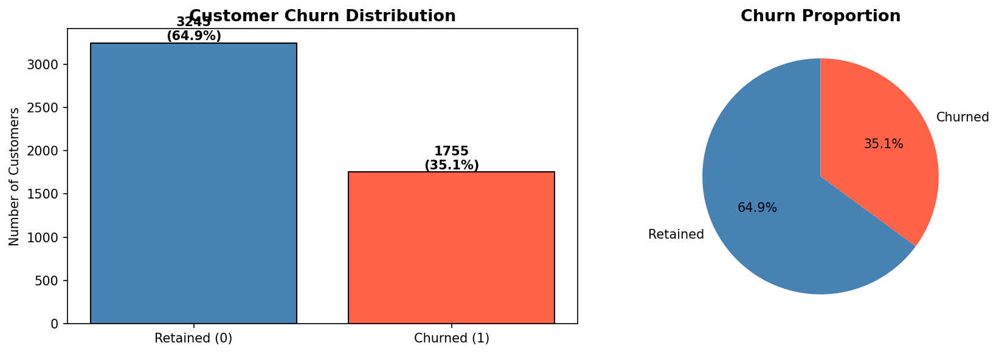 | Class imbalance — more retained than churned customers |
| 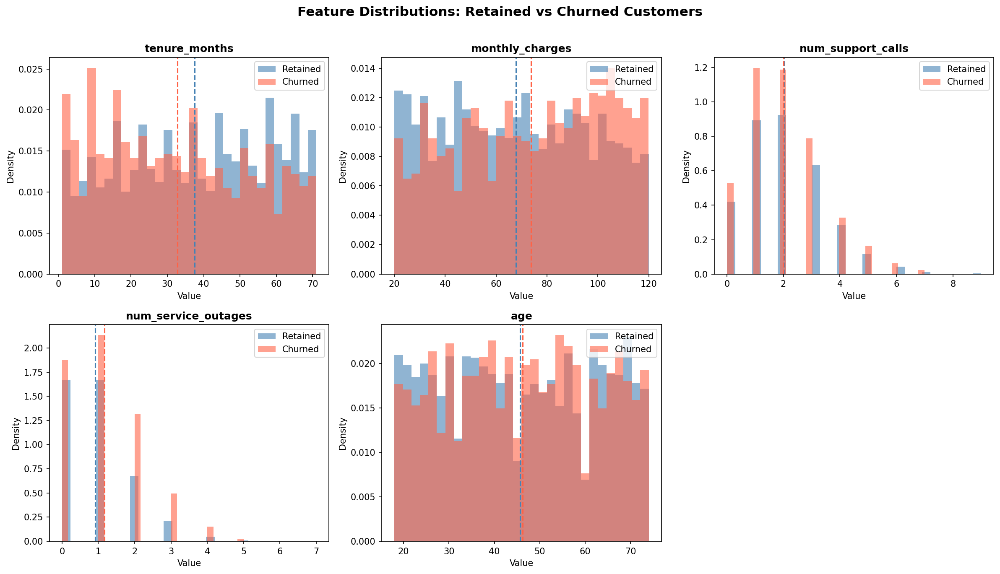 | How each feature differs between churned vs retained customers |
| 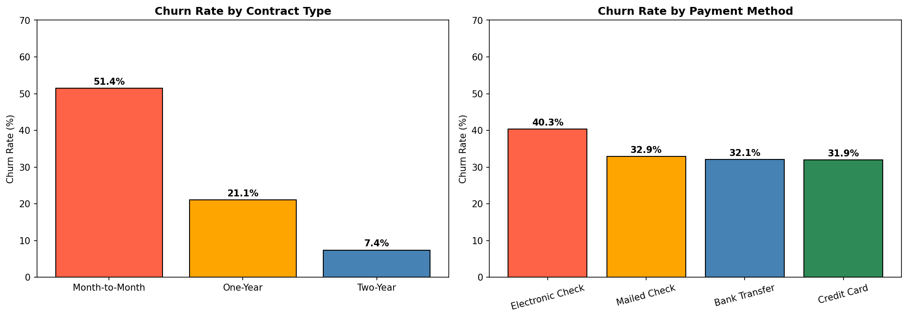 | Month-to-Month customers churn at 2× the rate of 2-year contracts |
| 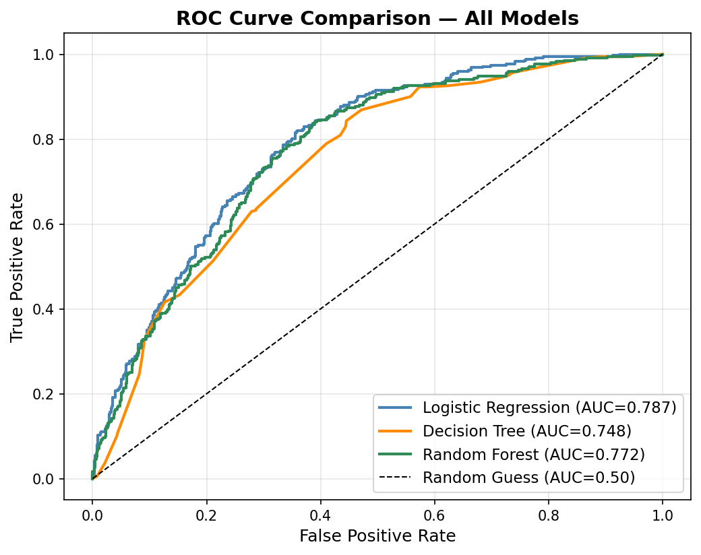 | Random Forest outperforms Logistic Regression and Decision Tree |
| 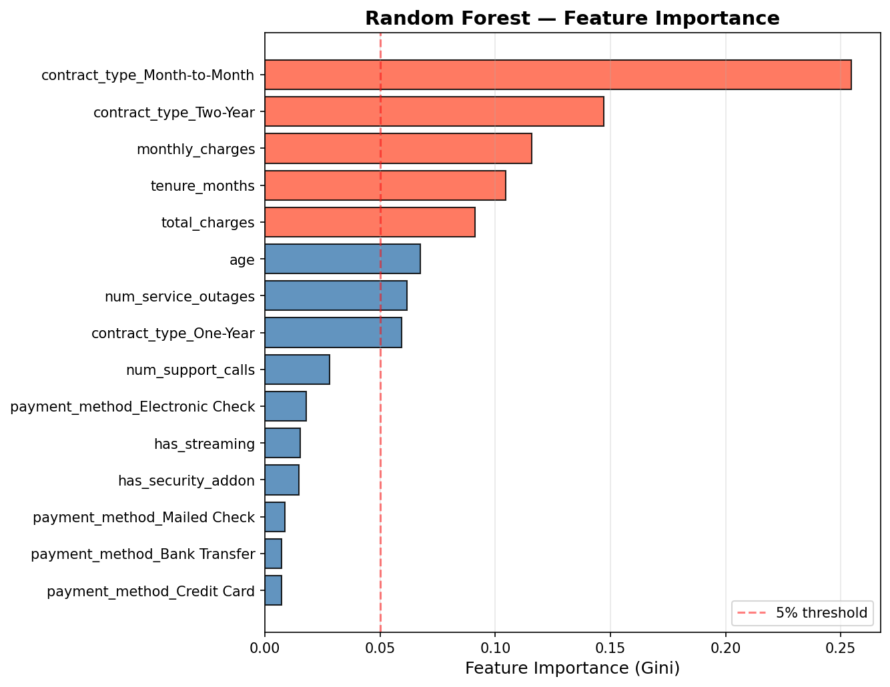 | Tenure and monthly charges matter most — directly actionable |
| 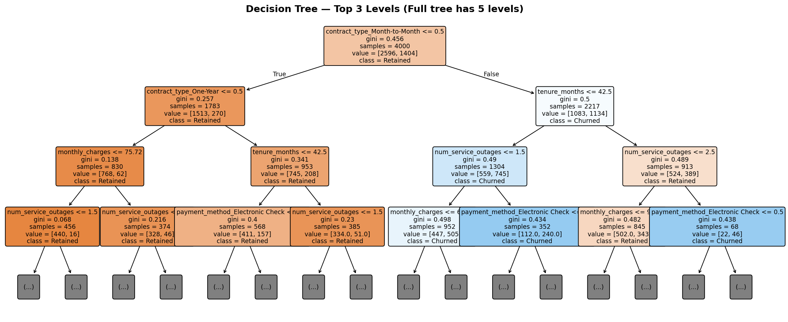 | The actual rules the tree learned — explainable to any stakeholder |

**Enterprise Use Case:** Customer retention at telecom, SaaS, banking — any subscription business.

**Notebook Stats:** 23 code cells · 17 explanation cells · 9 charts

---

### Module 2 — Deep Learning with PyTorch
📁 `module_02_deep_learning/module_02_deep_learning_pytorch.ipynb`

**The bridge from traditional ML to modern AI. Everything — GPT, Claude, Stable Diffusion — runs on what you learn here.**

**Business Problem:** Same churn dataset, but now we build a neural network from scratch, understand WHY it works, and know when to use it instead of Random Forest.

| What You Learn | Details |
|---|---|
| What is a Neuron? | Biology → artificial neuron, weighted sum, activation |
| Build a neuron from scratch | Pure NumPy, no libraries — full understanding |
| Activation Functions | ReLU, Sigmoid, Tanh, Leaky ReLU — what each does and why |
| The Vanishing Gradient Problem | Why ReLU replaced Sigmoid in hidden layers |
| Forward Pass | How data flows input → hidden → output |
| Loss Functions | Binary Cross-Entropy — how the model measures its own mistakes |
| Backpropagation | Chain rule in plain English; PyTorch's `.backward()` |
| Gradient Descent | Learning rate impact — too high, too low, just right |
| PyTorch Fundamentals | Tensors, autograd, `nn.Module`, `DataLoader` |
| The Training Loop | The engine behind all deep learning |
| Dropout & BatchNorm | Regularisation to prevent overfitting |
| Early Stopping | Save the best model, not the last one |
| NN vs Random Forest | When neural nets win — and when they don't |

**Key Charts:**

| Chart | What It Shows |
|---|---|
| 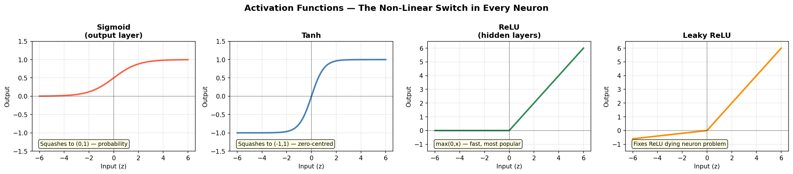 | Sigmoid, Tanh, ReLU, Leaky ReLU — the non-linear switches |
| 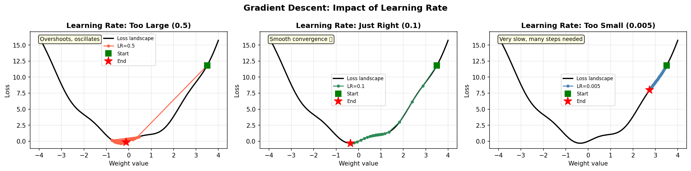 | Three learning rates: overshoots, converges, crawls |
| 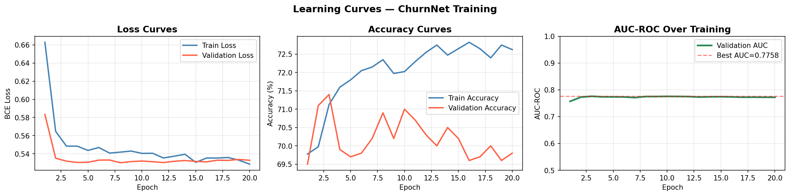 | Training vs validation loss — diagnosing overfitting |
| 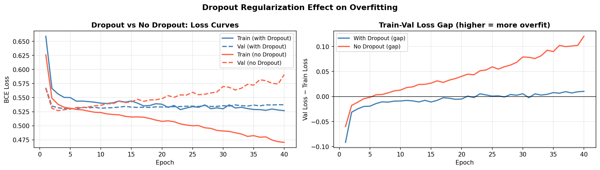 | With vs without Dropout — overfitting gap visualised |
| 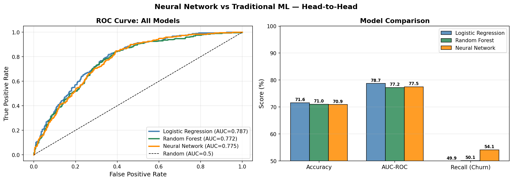 | Neural Network vs Random Forest vs Logistic Regression |
| 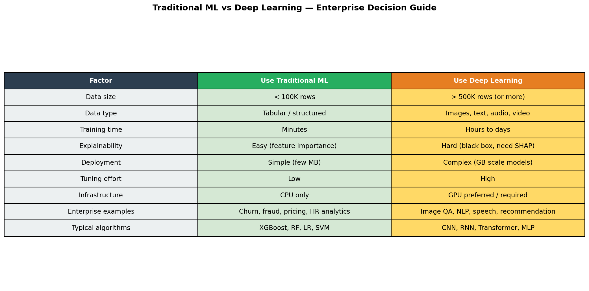 | Decision guide — which method for which situation |

**The honest lesson:** Random Forest often matches or beats Neural Networks on small tabular datasets — and this notebook shows exactly why, with data.

**Notebook Stats:** 17 code cells · 16 explanation cells · 7 charts

---

### Module 3 — Transfer Learning & Fine-Tuning BERT
📁 `module_03_transfer_learning/module_03_transfer_learning_bert.ipynb`

**This is where GenAI meets traditional ML. Pre-trained models. HuggingFace. The real thing.**

**Business Problem:** A bank's support team receives thousands of tickets daily. Manually routing them to the right team (Billing / Technical / Account / Complaint / General) costs time and money. We automate it with DistilBERT.

| What You Learn | Details |
|---|---|
| What is Transfer Learning? | Pre-training on billions of words → fine-tune on 600 examples |
| Why TF-IDF Fails on Text | No word order, no context — "bank" means the same near "river" or "loan" |
| How BERT Works | [CLS] token, attention heads, subword tokenization |
| DistilBERT vs BERT | 40% smaller, 60% faster, retains 97% performance |
| WordPiece Tokenization | How "unhappiness" becomes ["un", "##happi", "##ness"] |
| Fine-Tuning Loop | Same PyTorch loop from Module 2 — just starting from pre-trained weights |
| Attention Visualisation | Which words the model "looks at" when classifying |
| TF-IDF Baseline | Traditional NLP — what we're improving on |
| Transfer Learning Gap | How much BERT gains over classical methods |

**Key Charts:**

| Chart | What It Shows |
|---|---|
| 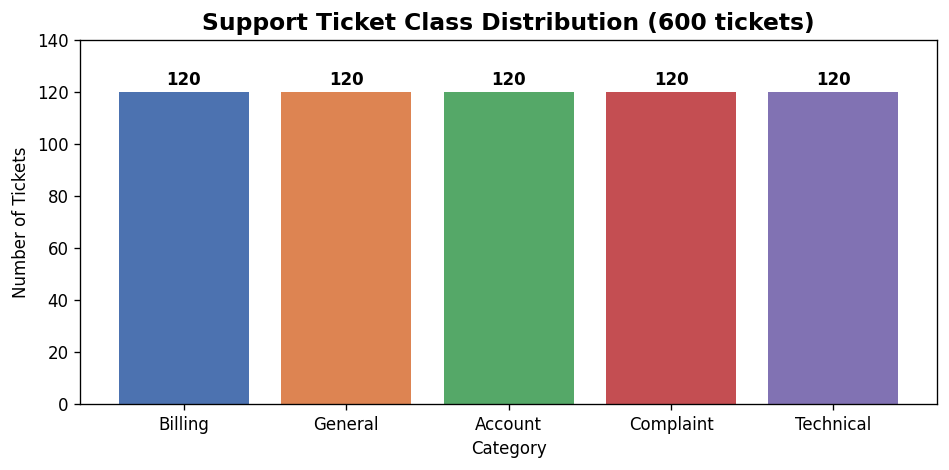 | Dataset distribution across 5 ticket categories |
| 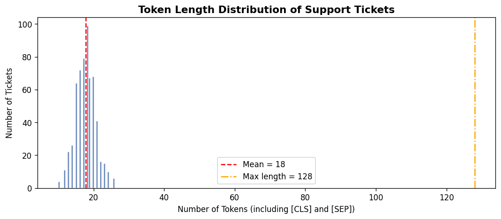 | How ticket text distributes across token counts after tokenization |
| 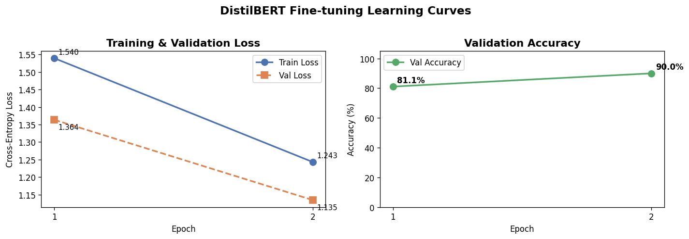 | Loss and accuracy across fine-tuning epochs |
| 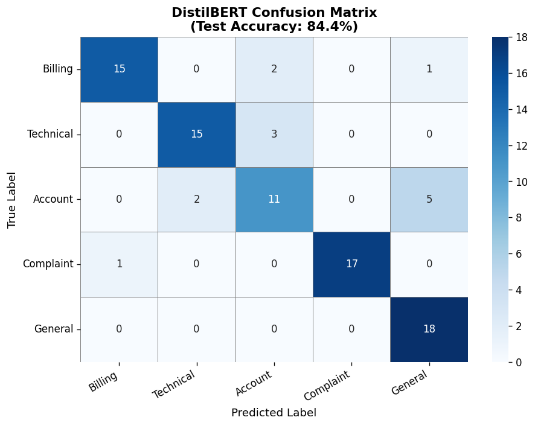 | Which categories the model confuses — actionable for improvement |
| 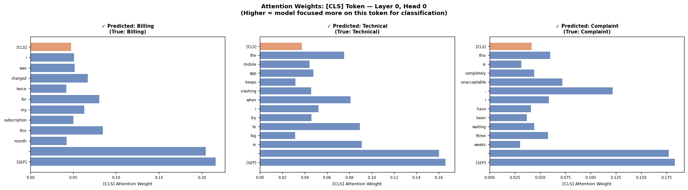 | Heatmap of which words the model attends to per prediction |
| 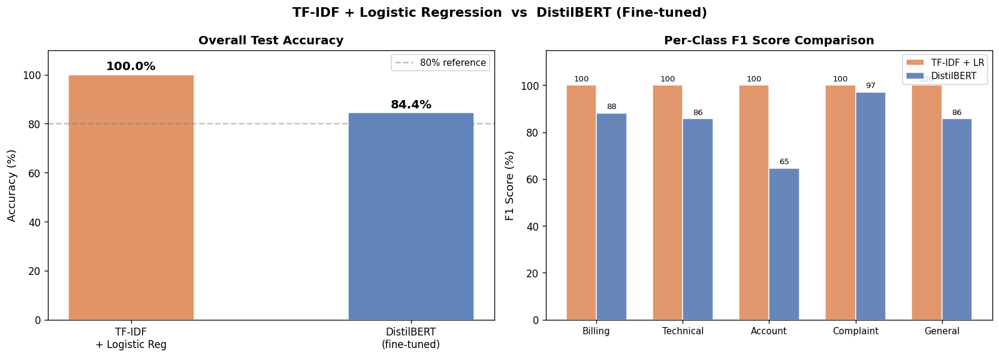 | Accuracy and F1 comparison: classical NLP vs transfer learning |

**The key insight:** With just 600 labeled examples, DistilBERT outperforms TF-IDF trained on the same data — because it already knows language from pre-training.

**Notebook Stats:** 12 code cells · 8 explanation cells · 6 charts

---

### Module 4 — Parameter-Efficient Fine-Tuning (LoRA / PEFT)
📁 `module_04_finetuning_methods/module_04_finetuning_methods.ipynb`

**The answer to: "How do companies fine-tune a 7 billion parameter model without a supercomputer?"**

**Business Problem:** A law firm needs to route legal documents to the right department (Contract / Litigation / Compliance / IP / HR). We fine-tune a classifier efficiently — training less than 1% of the model's parameters.

| What You Learn | Details |
|---|---|
| Why Full Fine-Tuning Is Expensive | A 7B model needs 112 GB RAM to fine-tune (16 bytes/param) |
| LoRA Math from Scratch | W_new = W + B×A where rank r ≪ d — 97.9% parameter reduction |
| The Rank Concept | Why low-rank approximation captures the important changes |
| HuggingFace PEFT | Wrap any model with LoRA in 3 lines of code |
| LoraConfig Parameters | r, lora_alpha, target_modules, lora_dropout explained |
| Trainable Parameter Counting | Full FT vs frozen vs LoRA r=4/8/16 side by side |
| QLoRA Concept | 4-bit quantisation + LoRA = fine-tune 7B on a single 8GB GPU |
| Prefix Tuning | Learned soft prompts — even lighter than LoRA |
| Prompt Tuning | Only 10K trainable parameters for a 110M model |
| PEFT Decision Guide | Which method for which situation |

**Key Charts:**

| Chart | What It Shows |
|---|---|
| 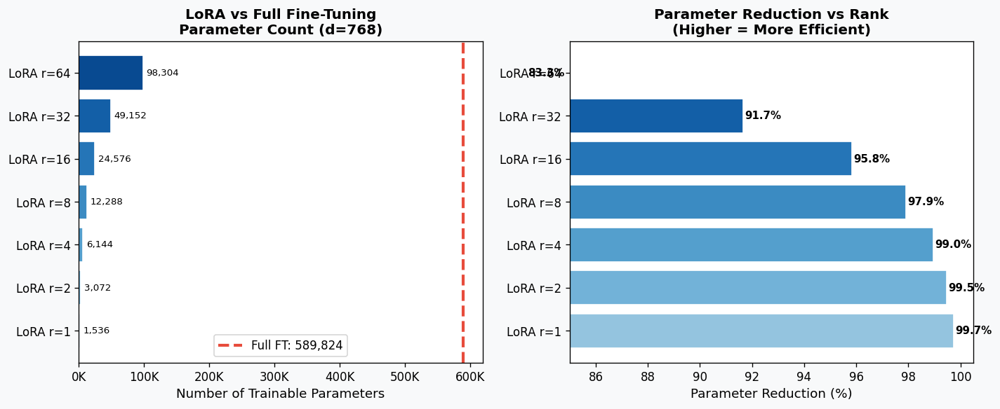 | Full fine-tune: 589,824 params vs LoRA: 12,288 params — same quality |
| 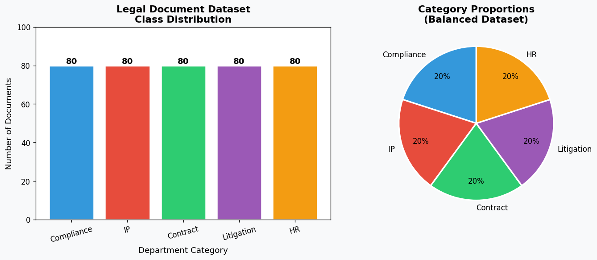 | Balanced 5-class legal document dataset |
| 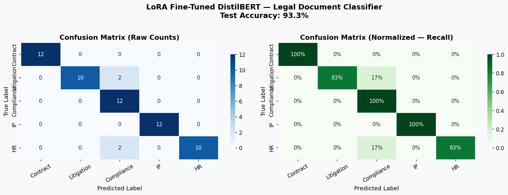 | LoRA fine-tuned model performance per category |
| 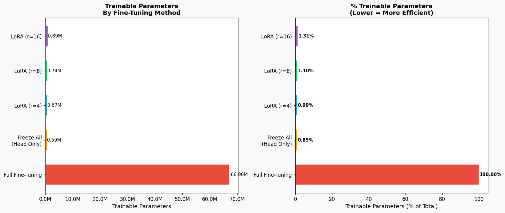 | Trainable parameter count across all PEFT variants |
| 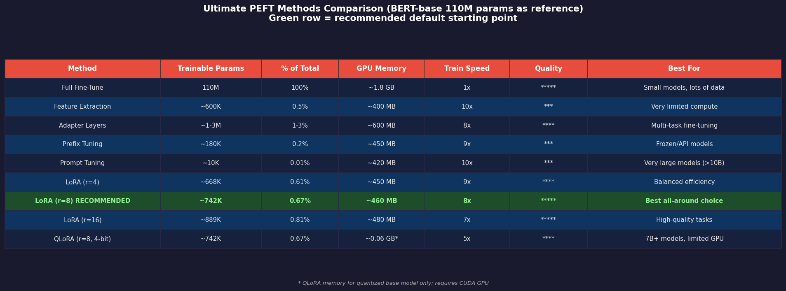 | All methods: params, memory, speed, quality, best-for |

**The key insight:** LoRA with rank=8 trains ~742K parameters instead of 110M — achieving nearly identical quality. This is how every major company fine-tunes LLMs affordably.

**Notebook Stats:** 10 code cells · 10 explanation cells · 5 charts

---

### Module 5 — RLHF & Model Alignment
📁 `module_05_rlhf/module_05_rlhf.ipynb`

**The "secret sauce" behind ChatGPT, Claude, and Gemini — explained and implemented from scratch.**

**Business Problem:** A customer service chatbot has been fine-tuned on response data, but it still sometimes gives rude or unhelpful answers. RLHF aligns it to prefer polite, helpful responses — without needing human feedback on every single output.

| What You Learn | Details |
|---|---|
| Why Alignment Is Needed | A model trained on next-token prediction can still be harmful |
| Stage 1 — SFT | Supervised Fine-Tuning on demonstration data |
| Stage 2 — Reward Model | Train a model to score responses as humans would |
| Stage 3 — PPO | Use the reward model to optimise the SFT model via RL |
| KL Divergence Penalty | Why we cap how far the model drifts from SFT behaviour |
| Preference Data | Chosen vs rejected response pairs — the fuel for RLHF |
| Reward Model From Scratch | TF-IDF + MLP trained on 320 preference pairs |
| PPO Conceptual Demo | Policy + frozen reference + KL penalty — working code |
| DPO — The Simpler Path | Direct Preference Optimisation: no reward model needed |
| DPO Loss From Scratch | Implemented in PyTorch, visualised over training |
| Constitutional AI | Anthropic's principle-based alternative to human labelling |
| RLAIF | Using a stronger AI (GPT-4) as the preference labeller |

**Key Charts:**

| Chart | What It Shows |
|---|---|
| 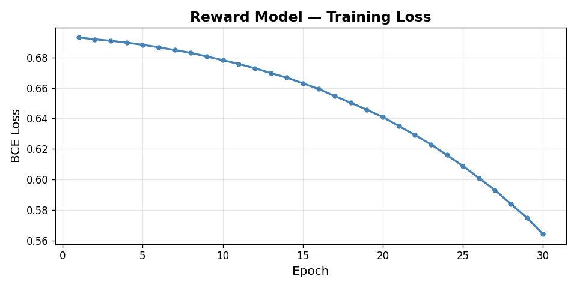 | Loss curve as the reward model learns to score chosen > rejected |
| 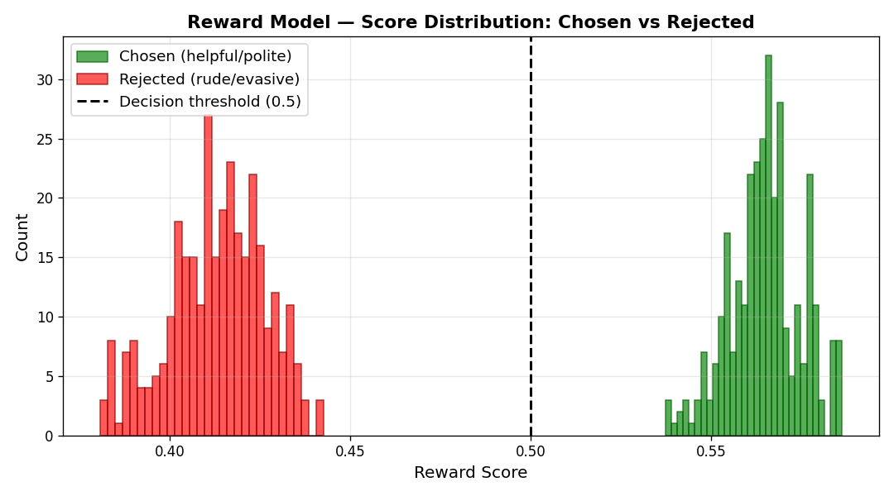 | Chosen responses score higher than rejected — the model is working |
| 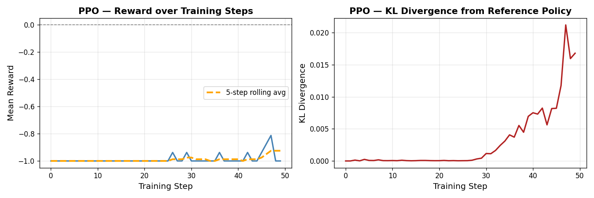 | Reward rising and KL divergence staying controlled over PPO steps |
| 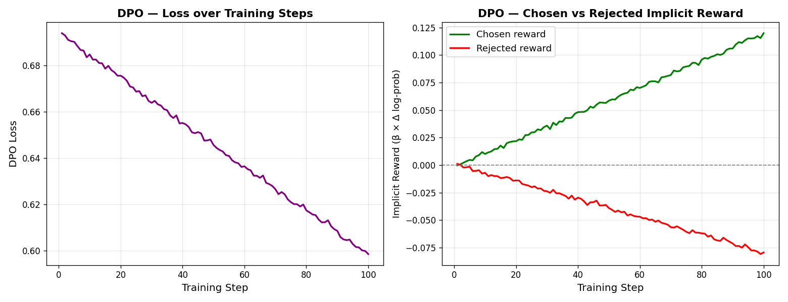 | DPO loss decreasing as model learns preference direction |
| 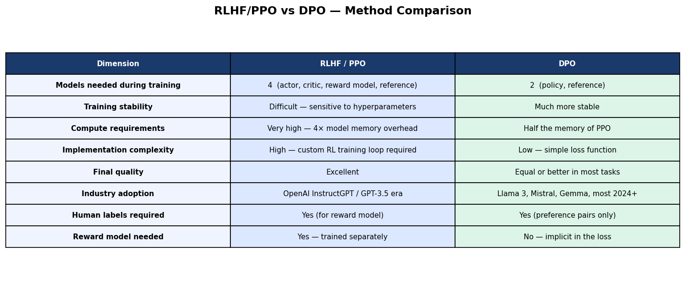 | Full comparison: models needed, stability, compute, complexity |
| 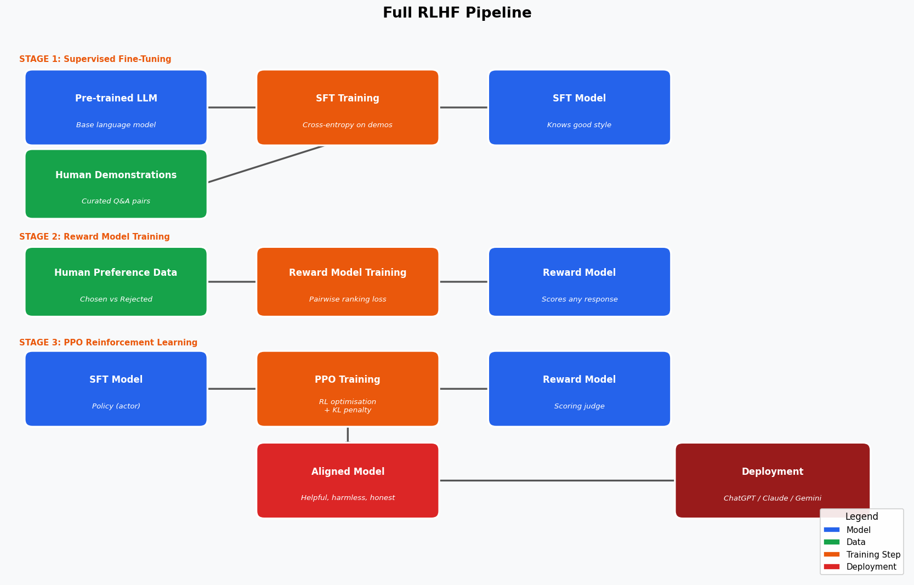 | The complete 3-stage RLHF pipeline — coloured flowchart |

**The key insight:** DPO achieves similar alignment to PPO with half the complexity — no separate reward model, no 4-model training setup. Most enterprise teams use DPO with ~1,000 preference pairs.

**Notebook Stats:** 8 code cells · 9 explanation cells · 6 charts

---

### Module 6 — MLOps: From Notebook to Production
📁 `module_06_mlops/module_06_mlops.ipynb`

**90% of ML models never reach production. This module teaches you how to be in the 10%.**

**Business Problem:** The churn model from Module 1 needs to go live — serving real API calls, monitored 24/7, auto-retrained when the world changes, and safely version-controlled so bad models can be rolled back in seconds.

| What You Learn | Details |
|---|---|
| What is MLOps? | DevOps for ML — the 5 pillars explained |
| The Research-to-Prod Gap | Jupyter notebook vs REST API serving 10K req/min |
| Experiment Tracking | MLflow logs every run: params, metrics, model artifacts |
| Querying Runs Programmatically | Find the best model across 100 runs with one line |
| Model Registry | Version lifecycle: None → Staging → Production → Archived |
| Model Serving with FastAPI | Complete /health + /predict API with Pydantic validation |
| Data Drift Detection | KS test flags distribution shifts before accuracy drops |
| Performance Monitoring | 12-month AUC simulation: stable → drifting → retrained |
| CI/CD for ML | GitHub Actions pipeline: validate → train → evaluate → promote |
| A/B Testing | Chi-square test decides whether to promote the challenger model |

**Key Charts:**

| Chart | What It Shows |
|---|---|
| 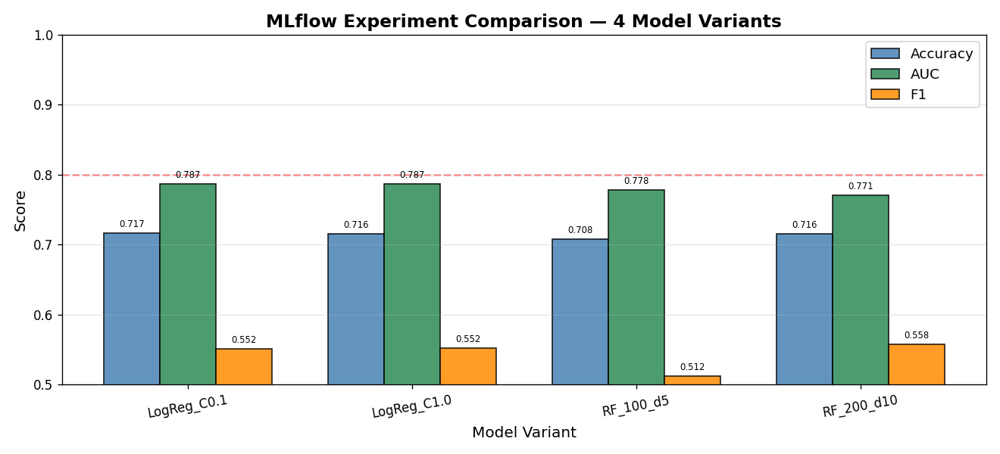 | All 4 model variants compared across Accuracy, AUC, F1 |
| 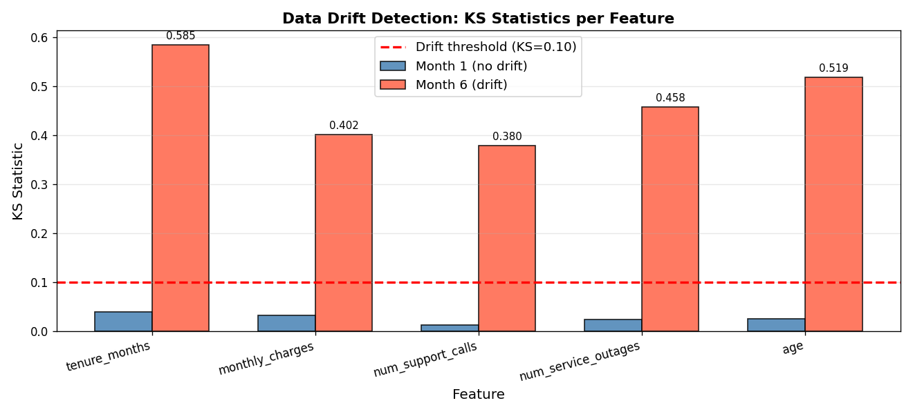 | Month 1: no drift. Month 6: all features drifted after competitor entry |
| 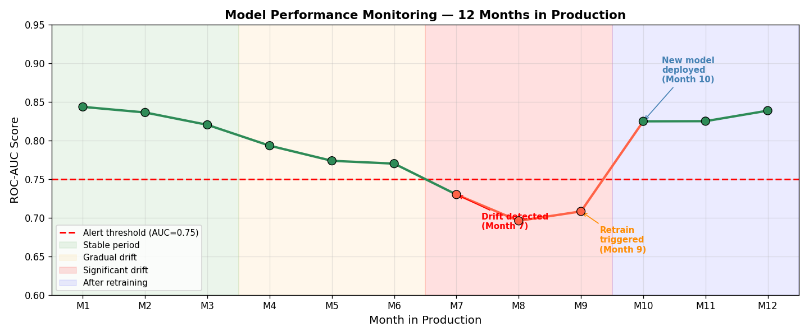 | AUC degrading over 9 months, then recovering after retraining |
| 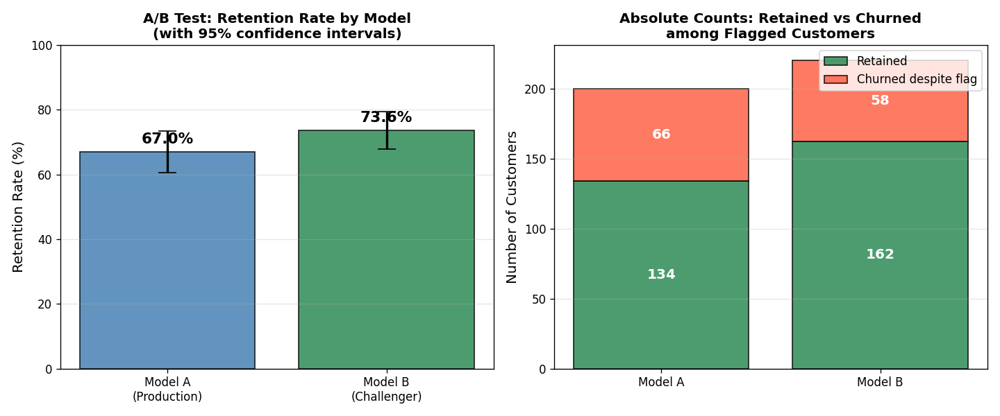 | Statistical test: Model B retains 74% vs Model A's 67% (p < 0.05) |
| 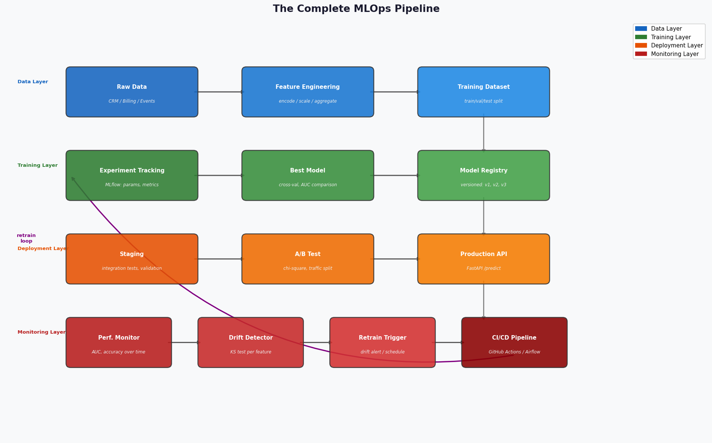 | The complete production ML lifecycle — 4-row pipeline diagram |

**The key insight:** A model without monitoring is a liability. Drift detection + automated retraining is what separates a data science project from a production ML system.

**Notebook Stats:** 10 code cells · 9 explanation cells · 5 charts

---

## 📊 Series at a Glance

| | M1: Traditional ML | M2: Deep Learning | M3: Transfer Learning | M4: PEFT/LoRA | M5: RLHF | M6: MLOps |
|---|---|---|---|---|---|---|
| **Difficulty** | ⭐⭐ | ⭐⭐⭐ | ⭐⭐⭐ | ⭐⭐⭐⭐ | ⭐⭐⭐⭐ | ⭐⭐⭐⭐ |
| **Prerequisite** | None | M1 | M2 | M3 | M4 | Any |
| **Use Case** | Churn Prediction | Churn (NN) | Ticket Classifier | Legal Doc Router | Chatbot Alignment | Churn → Production |
| **Algorithm** | LR · DT · RF | MLP (PyTorch) | DistilBERT | DistilBERT + LoRA | Reward Model · DPO | RF + MLflow + FastAPI |
| **Data Size** | 5,000 rows | 5,000 rows | 600 tickets | 400 documents | 320 pairs | 5,000 rows |
| **Runtime** | ~2 min | ~5 min | ~8 min | ~6 min | ~3 min | ~3 min |
| **Code Cells** | 23 | 17 | 12 | 10 | 8 | 10 |
| **Charts** | 9 | 7 | 6 | 5 | 6 | 5 |

---

## 🎯 Interview Questions This Series Prepares You For

<details>
<summary><b>Module 1 — Traditional ML</b></summary>

- Walk me through an end-to-end ML project you've built.
- What's the difference between precision and recall? When do you optimise for each?
- How do you handle overfitting in a Decision Tree?
- What is AUC-ROC and why is it better than accuracy for imbalanced datasets?
- What is cross-validation and why is a single train/test split not enough?

</details>

<details>
<summary><b>Module 2 — Deep Learning</b></summary>

- What is backpropagation? How does PyTorch autograd work?
- Why do we use ReLU instead of Sigmoid in hidden layers?
- What is the vanishing gradient problem?
- When would you use a neural network instead of a Random Forest?
- What is Dropout and how does it prevent overfitting?

</details>

<details>
<summary><b>Module 3 — Transfer Learning</b></summary>

- What is transfer learning and why does it matter?
- How does BERT represent context differently from TF-IDF?
- What is the [CLS] token used for?
- What is subword tokenization (WordPiece)?
- When would you fine-tune all layers vs just the classification head?

</details>

<details>
<summary><b>Module 4 — PEFT / LoRA</b></summary>

- What is LoRA and how does the rank decomposition work mathematically?
- Why can't you full-fine-tune a 7B model on a standard GPU?
- What is QLoRA and how does quantisation help?
- When would you use Prefix Tuning instead of LoRA?
- How does PEFT differ from feature extraction?

</details>

<details>
<summary><b>Module 5 — RLHF</b></summary>

- What is RLHF and why is it needed after supervised fine-tuning?
- What is a reward model and how is it trained?
- What is the difference between PPO and DPO?
- What is KL divergence penalty in RLHF and why is it important?
- What is Constitutional AI?

</details>

<details>
<summary><b>Module 6 — MLOps</b></summary>

- What is data drift and how do you detect it?
- How do you version ML models in production?
- Walk me through your ML deployment process.
- How do you decide when to retrain a model?
- How would you run an A/B test between two model versions?

</details>

---

## 🛠️ Tech Stack

| Category | Tools Used |
|---|---|
| **Data & ML** | pandas · numpy · scikit-learn |
| **Deep Learning** | PyTorch · torch.nn · torch.optim |
| **NLP & Transformers** | HuggingFace Transformers · DistilBERT · DistilGPT-2 |
| **Fine-Tuning** | HuggingFace PEFT · LoRA · TRL |
| **Alignment** | Custom reward model · DPO loss from scratch |
| **Experiment Tracking** | MLflow |
| **Model Serving** | FastAPI · Pydantic · Uvicorn |
| **Statistical Testing** | scipy.stats (KS test, chi-square) |
| **Visualisation** | matplotlib · seaborn |

---

## 📁 Repository Structure

```
finetune/
│
├── README.md                                    ← You are here
│
├── module_01_traditional_ml/
│   ├── module_01_traditional_ml_churn.ipynb    ← Main notebook
│   ├── churn_distribution.png
│   ├── feature_distributions.png
│   ├── categorical_churn.png
│   ├── correlation_heatmap.png
│   ├── confusion_matrix_lr.png
│   ├── roc_all_models.png
│   ├── feature_importance.png
│   └── decision_tree.png
│
├── module_02_deep_learning/
│   ├── module_02_deep_learning_pytorch.ipynb
│   ├── activation_functions.png
│   ├── gradient_descent.png
│   ├── bce_loss.png
│   ├── learning_curves.png
│   ├── dropout_comparison.png
│   └── model_comparison_all.png
│
├── module_03_transfer_learning/
│   ├── module_03_transfer_learning_bert.ipynb
│   ├── support_tickets.png
│   ├── token_lengths.png
│   ├── bert_learning_curves.png
│   ├── bert_confusion_matrix.png
│   ├── attention_viz.png
│   └── tfidf_vs_bert.png
│
├── module_04_finetuning_methods/
│   ├── module_04_finetuning_methods.ipynb
│   ├── lora_param_comparison.png
│   ├── legal_docs_distribution.png
│   ├── lora_confusion_matrix.png
│   ├── peft_comparison.png
│   └── ultimate_comparison.png
│
├── module_05_rlhf/
│   ├── module_05_rlhf.ipynb
│   ├── reward_model_training.png
│   ├── reward_score_distribution.png
│   ├── ppo_training.png
│   ├── dpo_training.png
│   ├── rlhf_vs_dpo.png
│   └── rlhf_pipeline.png
│
└── module_06_mlops/
    ├── module_06_mlops.ipynb
    ├── experiment_comparison.png
    ├── drift_detection.png
    ├── model_monitoring.png
    ├── ab_test.png
    └── mlops_pipeline.png
```

---

## 🔗 Recommended Learning Path

```
Week 1 ──► Module 1 (Traditional ML)       — Run every cell, modify hyperparameters
Week 2 ──► Module 2 (Deep Learning)        — Focus on the training loop section
Week 3 ──► Module 3 (Transfer Learning)    — Change the ticket categories to your domain
Week 4 ──► Module 4 (LoRA / PEFT)          — Try different rank values, observe param count
Week 5 ──► Module 5 (RLHF)                 — Write your own preference pairs
Week 6 ──► Module 6 (MLOps)               — Deploy the Module 1 model as a live API
```

**Best way to learn:** After reading each cell, close the output, re-type the code from memory, and re-run it. This is 10× more effective than just reading.

---

## 🚀 What to Build Next

After completing this series:

| Project Idea | Modules It Uses |
|---|---|
| Fine-tune a sentiment model on your company's reviews | M3 + M4 |
| Build a document Q&A system (RAG) | M3 + M4 + vector database |
| Create a chatbot aligned to your brand voice | M3 + M4 + M5 |
| Deploy a churn model as a live API with monitoring | M1 + M6 |
| Build an automated ML pipeline with drift alerts | M6 fully |

---

*Built as a self-study and team-sharing resource. All notebooks are self-contained, fully executed, and written with beginners in mind.*
